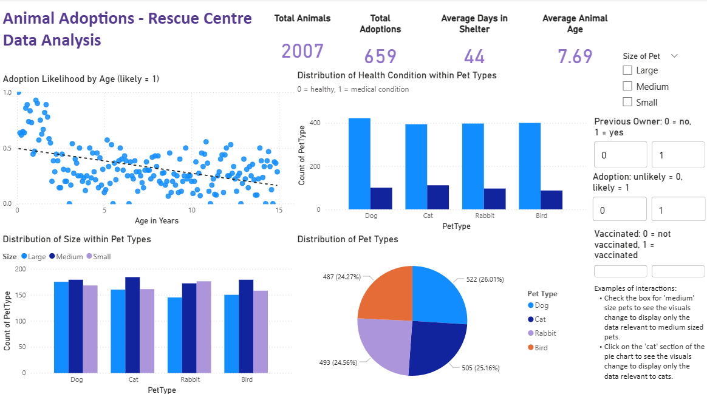
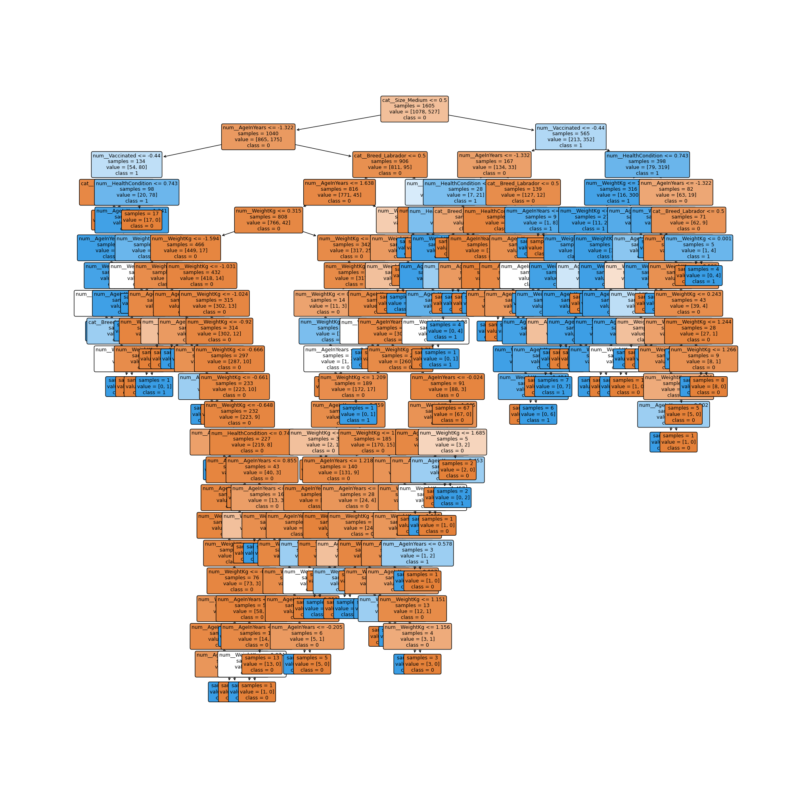

 

# Animal Adoption Project

*The dataset used in this project is taken from Kaggle and contains synthetic, Creative Commons publicly licensed data. The scenario and business requirements described in this project are fictional and are created solely for the purpose of this analysis.*

## Dataset Content

The data consists of 2007 rows and 13 columns:

`PetID`: Unique identifier for each pet\
`PetType`: Type of pet (e.g., Dog, Cat, Bird, Rabbit)\
`Breed`: Specific breed of the pet\
`AgeMonths`: Age of the pet in months\
`Color`: Color of the pet\
`Size`: Size category of the pet (Small, Medium, Large)\
`WeightKg`: Weight of the pet in kilograms\
`Vaccinated`: Vaccination status of the pet (0 - Not vaccinated, 1 - Vaccinated)\
`HealthCondition`: Health condition of the pet (0 - Healthy, 1 - Medical condition)\
`TimeInShelterDays`: Duration the pet has been in the shelter (days)\
`AdoptionFee`: Adoption fee charged for the pet (in dollars)\
`PreviousOwner`: Whether the pet had a previous owner (0 - No, 1 - Yes)\
`AdoptionLikelihood`: Likelihood of the pet being adopted (0 - Unlikely, 1 - Likely)

## Business Requirements

The manager of an animal rescue centre in Indiana has requested an analysis of the centre’s existing adoption data to better understand which factors influence an animal’s likelihood of being adopted. This project will explore trends within the dataset and identify the characteristics most strongly associated with successful adoptions.

Effective prediction of adoption likelihood would help the rescue centre prioritise animal care,  optimise its resources and improve operational planning. If the project outcomes demonstrate clear value, the approach will be expanded to include data from additional rescue centres across the state.

The rescue centre is one of many in a group of centres under the same company umbrella. They have requested that, where possible, the brand colour  lilac  be used in the dashboard. This will help if the dashboard is presented to management and trustees.

## Hypothesis and how to validate?

* List here your project hypothesis(es) and how you envision validating it (them)

* H1: Younger animals are more likely to get adopted
  - Null hypothesis: Age has no effect on the likelihood of an animal being adopted
  - Alternative hypothesis: Younger animals are more likely to be adopted
* H2: Vaccinated animals are more likely to get adopted
  - Null hypothesis: Vaccination has no effect on the likelihood of an animal being adopted
  - Alternative hypothesis: Vaccinated animals are more likely to be adopted
* H3: Larger animals are less likely to get adopted
  - Null hypothesis: Size has no effect on the likelihood of an animal being adopted
  - Alternative hypothesis: Size does have an effect on the likelihood of an animal being adopted
* H4: Some types of animals are more popular than others
  - Null hypothesis: Pet type has no effect on the likelihood of an animal being adopted
  - Alternative hypothesis: Pet type has an effect on the likelihood of adoption

* Train a machine learning model to: 
  1) Select which variables are most useful in predicting adoption outcomes 
  2) Predict if new animals are likely to be adopted or not

## Project Plan

1. `Ideation` - choose a dataset and ideate business requirements
2. `Extract` - Extract the chosen animal adoption dataset from Kaggle.
3. `Load` - Load and save the csv file via Pandas.
4. `Transform` - Clean and process the data using Pandas, adding new columns and checking for missing or duplicated values. Save to a new file.
5. `Visualise` - Create charts with Matplotlib, Seaborn and Plotly to visualise the data and check for outliers. Test the hypotheses in separate jupyter notebooks.
6. `Dashboard` - Create a Power BI dashboard to provide interactive insights.
7. `Analyse` - Interpret what the dashboard visualisations display, with plentiful comments in notebooks.
8. `Document` - Record findings and conclusions in the Readme and Dashboard.

Use CRISP-DM:  Cross Industry Standard Process for Data Mining
Use the Agile approach: small iterations with constant evaluation. Create a thorough and effective Kanban board to keep on track with tasks. 

## The rationale to map the business requirements to the Data Visualisations
* List your business requirements and a rationale to map them to the Data Visualisations

## Analysis techniques used

* Basic probability such as independence testing, and distribution analysis is used to understand how the variables affect adoption outcomes. Python is used to compute these probabilities directly from the data and to visualize underlying distributions.
Specific reasoning behind the choice of statistical tests:
* H1: The data is not normally distributed and the data is independent (one row per pet and no time series data); with one categorical variable and one continuous variable, therefore a Mann-Whitney U Test was used.
* H2, H3 and H4: The data is not normally distributed, the data is independent; both variables are categorical, therefore a Chi-Squared Test was used.
* The Pearson value for the p-value was chosen during the Chi-Squared Testing in Hypothesis 2 because it is the most widely accepted measure for detecting general associations between two categorical variables.
* Why a decision tree classifier? The target variable to be predicted is a binary output and therefore a classification model is appropriate. A decision tree was chosen becuase it is easy to interpret the outputs and it can handle both numerical and categorical features. A decision tree is suitable for identifying the most influential variables in predicting adoption outcomes.

* List the data analysis methods used and explain limitations or alternative approaches.
* How did you structure the data analysis techniques. Justify your response.
* Did the data limit you, and did you use an alternative approach to meet these challenges?
* How did you use generative AI tools to help with ideation, design thinking and code optimisation?

* Unfortunately in this synthetic dataset some of the variables could not be used as they were meaningless. The adoption fee was simply all of the numbers 1-499 listed and the weights of some the animals made no sense; rabbits are not generally over 2.5kg and some of them in the data were over 20kg.

## Ethical considerations
* The data is available publically on Kaggle, with a Creative Commons license (please see the Credits > Content section below).
* Provenance/ Dataset Description from Kaggle: 
  - "The Pet Adoption Dataset provides a comprehensive look into various factors that can influence the likelihood of a pet being adopted from a shelter. This dataset includes detailed information about pets available for adoption, covering various characteristics and attributes."
  - "This dataset is synthetic and was generated for educational purposes, making it ideal for data science and machine learning projects. It is an original dataset, owned by Mr. Rabie El Kharoua, and has not been previously shared. You are free to use it under the license outlined on the data card. The dataset is offered without any guarantees."
* There is no information present in the data that could identify an animal or person specifically. A PetID column was provided in the data, a decision was made to remove it.
* If this were real data then it would be necessary to inform the person adopting the pet about the data that is stored and how it will be used to help the shelter and future rescue animals. Adhering to GDPR and following the guidelines of the EU AI Act.
* Please refer to the Data Ethics section of the Power BI dashboard.

## Dashboard Design
* The Power BI dashboard is saved in the "dashboard" folder here in the repository.
* The intial wireframe drawing is also saved as an image .png file in the dashboard folder. 
* Screenshots of each page are saved to the images folder.

  
* Dashboard pages:
  1) Main Page: for non-technical audiences. Storytelling via visuals. The data can be explored through the use of four sliders.    
      - Sliders: size of pet, previous owner, adoption and vaccinated 
      - Cards showing: total number of animals, total number of adoptions, average number of days in the shelter and average animal age. Which update depending on which slider is chosen or which graph highlighted. 
      - Top left visual: scatter plot: Adoption Likelihood by Age
      - Top right visual: clusterd column chart: Distribution of Health Condition within Pet Types
      - Bottom left visual: clusterd column chart: Distribution of Size within Pet Types
      - Bottom right visual: pie chart: Distribution of Pet Types

  2) Tree Map: for non-technical audiences. Tree map of Pet Type > Breed > Colour to explore their relationships. With a key and explanation at the bottom. There is a card to show the total number of animals shown on the current tree map.  
  3) Data Ethics and Governance: for technical audiences. The text was produced with the help of generative AI. Detailed prompts were provided to chatGPT, with many refinements to get to the final, professional outcome.
  4) Conclusions: for technical audiences. Business Requirements and Conclusions section. Data source included
* User testing: suggested it would be a good idea to add my name to the dashboard and the Code Institute logo. Extra tooltips were added to the visuals on the main page. 
* The information was split into four separate pages to keep the main visuals on one page and clear. The explanations were kept together for the technical audience.
* For the non-technical audience on the bottom right of the main page, under the slicers are examples of how to use them.
* Power BI is a very useful tool: if more data became available, as long as it is in the same columns and format, it could simply be added to the existing data and all of the visuals would update.

## Conclusions

Hypothesis 1: The alternate hypothesis is correct: Younger animals are more likely to be adopted. 

Hypothesis 2: The alternate hypothesis is correct: Vaccinated animals are more likely to be adopted. 

  - Hypothesis 2a: There is no correlation between Vaccination and Health Condition. Perhaps this needs to be investigated. 

Hypothesis 3: The alternate hypothesis is correct: Size does have an effect on the likelihood of adoption. 

Hypothesis 4: The alternate hypothesis is correct: The type of pet does have an effect on the likelihood of adoption. 

Predictive modelling using a Decision Tree Classifier shows that the most important features are: Medium Size; Age; Vaccination; Health Condition and Labrador.

The model can predict for the rescue centre whether a new animal is likely to be adopted (provided no unforeseen variables are used).

In reality datasets like these could be used to help rescue centres, as with this foundation in the US: https://www.shelteranimalscount.org/

To take this further and to make a more accurate predictive model it would be great to get data around whether the animals are neutered and if a profile of them exists (no actual details about the animal for GDPR, just the existence of a profile with a name, photo or description). 

## Unfixed Bugs
* ipykernel needed to be installed to ensure that the notebooks use the virtual environment where the packages are installed. Pip was also upgraded to ensure everything ran smoothly.
* In the notebook 06_hypothesis_3_and_4, in cell 14 of 28, there is a future warning. The code to convert the variables to strings for use in plotly will produce an error after a future update. 

## Development Roadmap
* The Code Institute Data Analytics template was cloned from git hub and the following python libraries were added to the requirements.txt file: wordcloud, pingouin and nbformat.
* In notebook 02_eda_visuals I had some trouble creating a heatmap. There are so many variables in the correlation that it was difficult to glean any information. I tried a few times, with the aid of generative AI, to manipulate the heatmap using the original correlated dataframe. However, it was taking a long time and I didn't want to get bogged down so early on. Therefore I decided to create a simpler correlated dataframe with just the variables I was interested in. This made for a clearer and more useful heatmap. I now know that correlation tables are something I need to learn in more depth.
* In order to learn the most important features from the machine learning classification model, I had to rely heavily on code from the Code Institute's teachings and help from chatGPT. Evaluating the machine learning model is something I really need to go back over and understand more thoroughly.
* Different hyperparameters were not tested in this project. That will be something I try out in a personal project after the course. 
* The next logical step in Power BI would be to use DAX to create new measures to take a deeper dive in to the data and discover further relationships between the variables.

## Deployment
* The Power BI dashboard is saved in the "dashboard" folder here in the repository. Download the file to open. A copy of the dashboard with temporarily be published using Power BI Pro.

## Main Data Analysis Libraries
* Here you should list the libraries you used in the project and provide an example(s) of how you used these libraries.

## Reflection
* Hindsight is a wonderful thing. In Power BI it would have been more useful to still have the pet ID column to create visuals.
* Leading up to the Christmas break is a very difficult and busy time of year with lots of distractions. The pomodoro technique was useful, along with lots of planning, and the need to be adaptable.

## Credits 

* In this section, you need to reference where you got your content, media and extra help from. It is common practice to use code from other repositories and tutorials, however, it is important to be very specific about these sources to avoid plagiarism. 
* You can break the credits section up into Content and Media, depending on what you have included in your project. 

### Content 

- Template: https://github.com/Code-Institute-Org/data-analytics-template 
- Data sourced from Kaggle: https://www.kaggle.com/datasets/rabieelkharoua/predict-pet-adoption-status-dataset/data
- The data is shared under the Creative Commons Licence: CC BY 4.0 International
- https://doi.org/10.34740/kaggle/ds/5242440
- For the intial retrieval of data and EDA I reused code from my previous two projects on github.
- In notebook 03_hypothesis_1.ipynb the definitions of alpha and p-value were taken from the Code Institute's Learning Management System, from the Foundational Data Analysis Techniques section. 
- In the machine learning model, notebook 05_mlearning.ipynb the Code Institute's teaching was used heavily, along with generative AI, to help extract the most important features learnt from the Classification model.
- Photo at the bottom of the readme file <a href="https://www.vecteezy.com/free-vector/rabbit">Rabbit Vectors by Vecteezy</a>

## Acknowledgements

* I would like to say a huge thank you to my Tutor and Data Coaches at Code Institute for their teaching, advice and support.
* I am grateful to my fellow September 2025 cohort: for the help and the laughs.
* A final thank you to generative AI (Copilot and chatGPT) for their assistance and suggestions when I needed a little nudge in the right direction or to clarify an idea.

